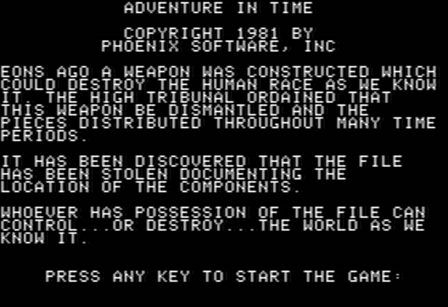

# Adventure In Time   ![Badge Publisher]

*Source code provided by **[Paul Berker]**.*

 

 
 

[![Button Interview]][Interview]

 
 

 
 

## Platforms

<kbd>  Apple II  </kbd>   <kbd>  Atari 8-bit  </kbd>

 
 

## Files

*The file archives provided.*

### Atari ( Toolkit )

[![Button Source]][Source Atari]   
[![Button Disk]][Disk Atari]

 

### Modem

[![Button Source]][Source Modem]   
[![Button Disk]][Disk Modem]

 

### Code 1

[![Button Source]][Source Code 1]   
[![Button Disk]][Disk Code 1]

 

### Code 2   `1981 - 08 - 04`

[![Button Source]][Source Code 2]   
[![Button Disk]][Disk Code 2]

 

<!----------------------------------------------------------------------------->

[Paul Berker]: https://slasherworld.com/

[Interview]: https://archive.org/details/paul-berker-phoenix-software

[Source Code 1]: Source/Code%201
[Source Code 2]: Source/Code%202
[Source Modem]: Source/Modem
[Source Atari]: Source/Atari

[Disk Code 1]: Disks/Code%201.DSK
[Disk Code 2]: Disks/Code%202.DSK
[Disk Modem]: Disks/Modem.DSK
[Disk Atari]: Disks/Atari.DSK

<!----------------------------------[ Badges ]--------------------------------->

[Badge Publisher]: https://img.shields.io/badge/Publisher-Phoenix_Software-bb603d?style=for-the-badge&labelColor=EF7B4D

<!---------------------------------[ Buttons ]--------------------------------->

[Button Interview]: https://img.shields.io/badge/Interview-49B48A?style=for-the-badge&logoColor=white&logo=InternetArchive
[Button Source]: https://img.shields.io/badge/Source-0091BD?style=for-the-badge&logoColor=white&logo=CodeFactor
[Button Disk]: https://img.shields.io/badge/Disk-50162D?style=for-the-badge&logoColor=white&logo=Discogs

